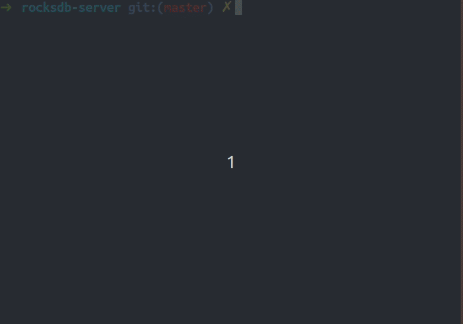

# RocksDB-server

RocksDB-server is a remote call wrapper for RocksDB. It provides an interface to the client program for remote operation of the database. I'm considering adding the cluster support.

## Motivation

This project is derived from the little-work assigned by PingCAP.

## Demo



## Build & Run

Supported platform: Linux.

Make sure you have [libuv](https://github.com/libuv/libuv#build-instructions) and [rocksdb](https://github.com/facebook/rocksdb/blob/master/INSTALL.md) installed.

Just clone the repo and execute `make` command.

```shell
# run the server
./run-server [database_dir] [tcp_port]

# run the test program
./run-client [Database_IP] [Database_PORT]
```

## Client interface

```c++
// construct a handler
DBserver db("127.0.0.1", 8888);

// connection
db.Connect();

// PUT
db.Put(key, value);

// GET
db.Get(key, &value);

// DELETE
db.Delete(key);

// SCAN
db.Scan(key1, key2, pairs);
```

## Architecture

The client performs command parsing and network message packet encapsulation. The server uses a event loop to check pending request events and put those workers into a thread pool. Because RocksDB supports multi-threading, parallel acceleration can be maximized when multiple clients perform read operations.